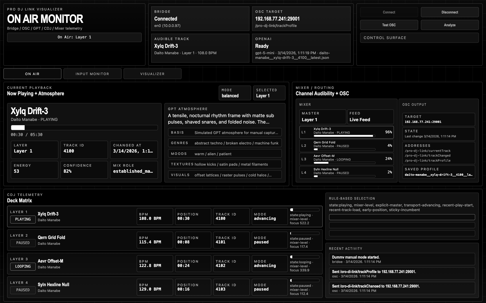
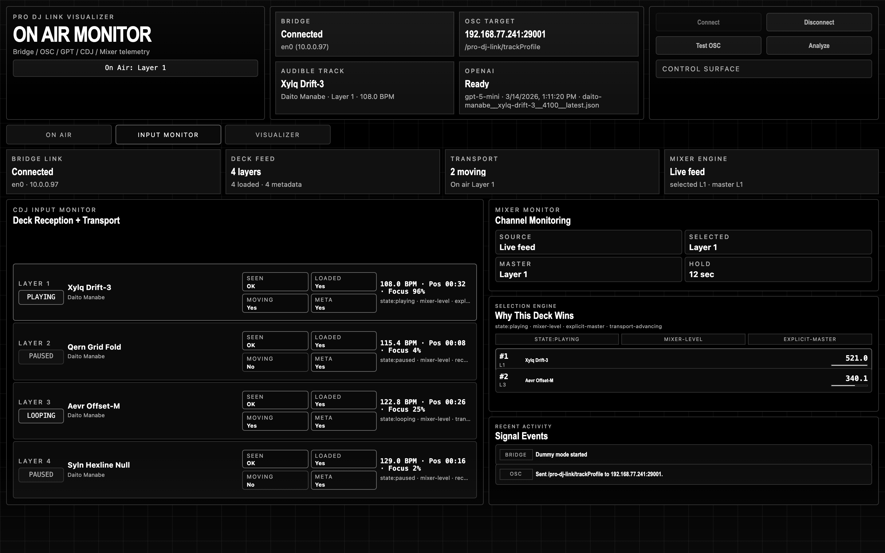
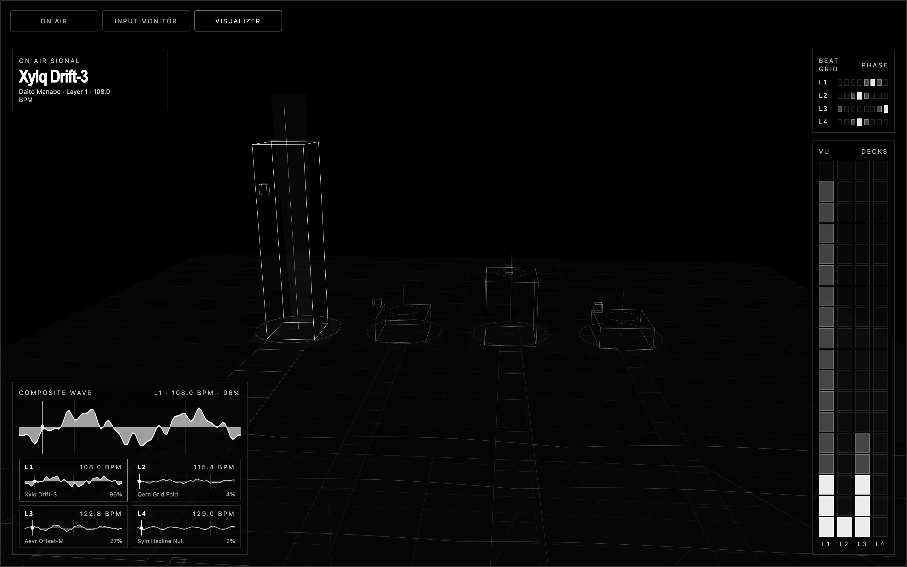
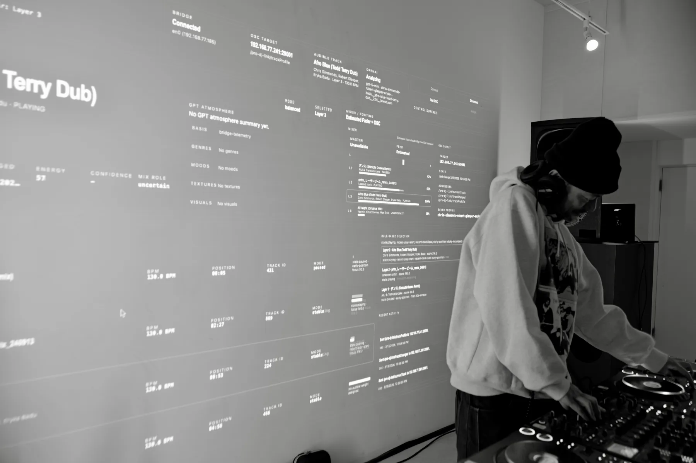

# pro-djlink-manager

`pro-djlink-manager` is a live orchestration web app that reads playback state from `Pro DJ Link Bridge`, selects the track that is most likely on air, analyzes deterministic playback features plus GPT-based atmosphere cues, and sends the result to venue systems over OSC.

It is designed to let a DJ set drive not only lighting and video, but also interfaces such as drink menus, robotic devices, and other room-scale control surfaces.



## What this repository contains

- Node.js backend for `Pro DJ Link Bridge` ingestion, track selection, OSC output, and OpenAI-based atmosphere analysis
- Browser UI for monitoring CDJ state, mixer heuristics, OSC routing, and a WebGL mix visualizer
- Dummy mode for documentation, demos, and UI capture without live hardware
- `TouchDesigner` OSC receiver example
- Public screenshots and optimized event photos

## Repository scope

This public repository intentionally excludes:

- vendor manuals and manual-derived full-text exports
- raw event photos
- generated track profile caches
- local deployment bundles and machine-specific paths

## Screens

### On Air


### Input Monitor



### Visualizer



## Event usage

The optimized event photos below show the app in actual use as a control layer between DJ playback and room systems.




## Core behavior

1. `Pro DJ Link Bridge` publishes TCNet telemetry.
2. `pro-djlink-manager` monitors `Layer 1-4`.
3. A rule-based selector chooses the most plausible on-air track using playback state, transport movement, mixer heuristics, recency, and hold logic.
4. Deterministic playback features are derived from telemetry.
5. If `OPENAI_API_KEY` is set, GPT infers atmosphere, texture, mood, and visual cues from metadata and rule-based context only.
6. OSC messages and a JSON profile are sent to downstream systems.

## Quick start

```bash
npm install
npm start
```

Open:

- [http://localhost:3000](http://localhost:3000)

If port `3000` is already in use, choose another one:

```bash
PORT=3001 npm start
```

## Environment variables

Create `.env` from `.env.example`.

```bash
PORT=3000
OSC_HOST=127.0.0.1
OSC_PORT=29001
OPENAI_API_KEY=
OPENAI_MODEL=gpt-5-mini
DUMMY_MODE=false
```

## OSC outputs

Default target in the public repo:

- host: `127.0.0.1`
- port: `29001`

Addresses:

- `/pro-dj-link/currentTrack`
- `/pro-dj-link/trackChanged`
- `/pro-dj-link/trackProfile`
- `/pro-dj-link/test`

See [OSC spec](docs/OSC_SPEC.md) for the full argument layout.

## Dummy mode

Dummy mode runs the full UI and OSC pipeline without live CDJs.

```bash
PORT=3000 DUMMY_MODE=true npm start
curl -X POST http://localhost:3000/api/dummy/start
```

To capture documentation screenshots:

```bash
npm run capture:dummy
```

See [dummy mode notes](docs/DUMMY_MODE.md).

## TouchDesigner example

A TouchDesigner-oriented OSC receiver example is included here:

- [TouchDesigner example README](examples/touchdesigner/README.md)
- [TouchDesigner callback script](examples/touchdesigner/prodjlink_manager_osc_callbacks.py)
- [Sample profile JSON](examples/touchdesigner/sample-track-profile.json)

## Emulator

The repository also includes a `PRO DJ LINK` emulator for dry-run testing.

```bash
npm run emulator -- --interface en0
```

Loopback dry run:

```bash
npm run emulator -- --interface en0 --bind-address 127.0.0.1 --broadcast 127.0.0.1 --no-startup
```

## OpenAI usage

Only non-deterministic atmosphere cues are delegated to GPT.

- deterministic: state, BPM, track window, playback role, energy
- inferred by GPT: atmosphere summary, likely genres, moods, textures, visual keywords, color palette

The model must not claim it listened to audio. It only uses metadata and rule-based analysis context.

## File layout

See [FILE-STRUCTURE.md](FILE-STRUCTURE.md).

## Notes for publication

- This repository is the public-ready version.
- The development workspace remains separate.
- If you need the exhibition page or project site export, generate that from the development workspace instead of committing local publish bundles here.
